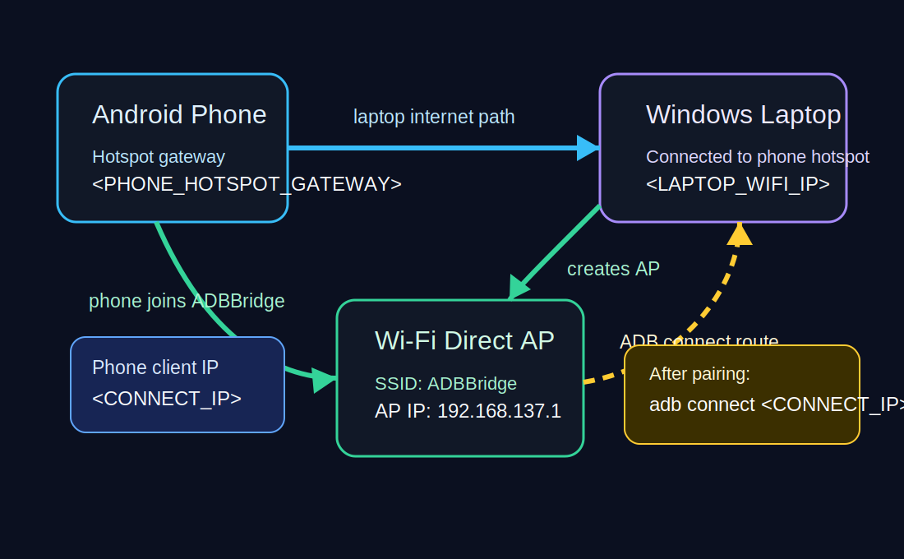

# Detailed Guide

This file explains the details behind the simple process in [README.md](README.md).

Use it only when you want to understand the setup, run the manual commands, or debug a failed pairing.

## Core Idea

Android Wireless debugging needs a network path. Usually that means the laptop and phone are both connected to the same home Wi-Fi router.

If there is no common Wi-Fi router, Windows can create a small local Wi-Fi Direct Legacy AP. The phone joins that laptop-created network. The laptop pairs with Android Wireless debugging over that path. After ADB connects once, the phone can be switched to classic TCP ADB on port `5555` for easier reconnects.

Best short description:

```text
ADB without USB cable/data and without a common Wi-Fi router.
```

This is not ADB without any Wi-Fi radio. It still uses Wi-Fi, but the laptop creates the local network.

## What to Call This

Useful search phrases:

- ADB without USB cable
- ADB without USB data
- ADB without common Wi-Fi
- Wireless ADB without external Wi-Fi
- Android wireless debugging without router
- ADB install without USB cable
- Windows Wi-Fi Direct ADB bridge
- Android debugging using phone hotspot and laptop Wi-Fi

## Value Decoder

Wireless ADB has two different screens and two different ports. Most failures happen because the pairing port is mistaken for the connect port.

### Pairing Popup Values


When you tap **Pair device with pairing code**, Android shows:

- `SIX_DIGIT_CODE`: the six-digit number, for example `123456`.
- `PAIRING_IP:PAIR_PORT`: the temporary pairing address, for example `192.168.137.42:43123`.

Use these only with:

```powershell
adb pair <PAIRING_IP>:<PAIR_PORT> <SIX_DIGIT_CODE>
```

Do not use the pairing port with `adb connect`.

### Main Wireless Debugging Screen Values


After pairing, close the pairing popup and return to the main **Wireless debugging** screen.

The line labeled **IP address and port** should show:

```text
<CONNECT_IP>:<CONNECT_PORT>
```

Use that with:

```powershell
adb connect <CONNECT_IP>:<CONNECT_PORT>
```

If the screen shows only an IP with no `:port`, the ADB connect listener is not active yet. Toggle Wireless debugging off/on, reconnect Wi-Fi, or follow the Wi-Fi Direct AP plus ICS flow.

## Network Topology



Common placeholders:

| Placeholder | Meaning | How to find it |
|---|---|---|
| `<PAIRING_IP>:<PAIR_PORT>` | Temporary endpoint from the pairing popup | Phone -> Wireless debugging -> Pair device with pairing code |
| `<SIX_DIGIT_CODE>` | Temporary six-digit pairing code | Same pairing popup |
| `<CONNECT_IP>:<CONNECT_PORT>` | Actual ADB connection endpoint | Main Wireless debugging screen, or `adb mdns services` as `_adb-tls-connect._tcp` |
| `<PHONE_HOTSPOT_GATEWAY>` | Phone's hotspot-side IP as seen by Windows | `Get-NetIPConfiguration -InterfaceAlias 'Wi-Fi'` -> `IPv4DefaultGateway` |
| `<LAPTOP_WIFI_IP>` | Laptop's IP on the phone hotspot | `Get-NetIPConfiguration -InterfaceAlias 'Wi-Fi'` -> `IPv4Address` |
| `<ADB_SERIAL>` | Device identifier shown by ADB | `adb devices -l` |

Example mDNS output:

```text
adb-xxxx  _adb-tls-pairing._tcp  192.168.137.42:43123
adb-xxxx  _adb-tls-connect._tcp  192.168.137.42:45678
```

Correct commands for that example:

```powershell
adb pair 192.168.137.42:43123 123456
adb connect 192.168.137.42:45678
```

## Manual Flow

The wizard runs these pieces for you, but you can run them manually.

### Install Platform Tools

```powershell
New-Item -ItemType Directory -Path .\work\android -Force | Out-Null
curl.exe -L --fail --output .\work\android\platform-tools-latest-windows.zip https://dl.google.com/android/repository/platform-tools-latest-windows.zip
Expand-Archive -Path .\work\android\platform-tools-latest-windows.zip -DestinationPath .\work\android -Force
.\work\android\platform-tools\adb.exe version
```

### Start the Laptop Wi-Fi Direct AP

```powershell
powershell.exe -NoProfile -ExecutionPolicy Bypass -File .\scripts\start-wifi-direct-ap.ps1
```

Defaults:

```text
SSID: ADBBridge
Password: ChangeMe123!
Laptop AP IP: usually 192.168.137.1
```

Keep this PowerShell process running.

### Share Internet Into the AP

This is optional in theory, but it can help Android expose the Wireless debugging connect service reliably.

Run as administrator:

```powershell
powershell.exe -NoProfile -ExecutionPolicy Bypass -File .\scripts\enable-ics-to-adbbridge.ps1
```

Default adapter names:

```text
Public internet adapter: Wi-Fi
Private AP adapter: Local Area Connection* 2
```

If your Windows adapter names differ, pass them as arguments:

```powershell
powershell.exe -NoProfile -ExecutionPolicy Bypass -File .\scripts\enable-ics-to-adbbridge.ps1 -PublicAdapter "Wi-Fi" -PrivateAdapter "Local Area Connection* 2"
```

### Clear Stale ADB State

On the phone:

1. Wireless debugging -> Paired devices.
2. Forget the old laptop pairing.

On the laptop:

```powershell
.\work\android\platform-tools\adb.exe kill-server
Get-Process adb -ErrorAction SilentlyContinue | Stop-Process -Force
Remove-Item "$env:USERPROFILE\.android\adb_known_hosts.pb" -Force -ErrorAction SilentlyContinue
.\work\android\platform-tools\adb.exe start-server
```

### Pair and Connect

On the phone:

1. Wireless debugging -> Pair device with pairing code.
2. Keep the pairing popup open.

On the laptop:

```powershell
.\work\android\platform-tools\adb.exe mdns services
```

You want to see both services:

```text
<id>    _adb-tls-pairing._tcp    <PAIRING_IP>:<PAIR_PORT>
<id>    _adb-tls-connect._tcp    <CONNECT_IP>:<CONNECT_PORT>
```

Pair:

```powershell
.\work\android\platform-tools\adb.exe pair <PAIRING_IP>:<PAIR_PORT> <SIX_DIGIT_CODE>
```

Connect:

```powershell
.\work\android\platform-tools\adb.exe connect <CONNECT_IP>:<CONNECT_PORT>
.\work\android\platform-tools\adb.exe devices -l
```

Expected:

```text
<CONNECT_IP>:<CONNECT_PORT>    device ...
```

### Make Reconnect Easy with Port 5555

Once connected, switch to classic TCP mode:

```powershell
.\work\android\platform-tools\adb.exe -s <CONNECT_IP>:<CONNECT_PORT> tcpip 5555
```

Reconnect:

```powershell
.\work\android\platform-tools\adb.exe connect <PHONE_IP_OR_GATEWAY>:5555
.\work\android\platform-tools\adb.exe devices -l
```

If duplicate transports appear:

```powershell
.\work\android\platform-tools\adb.exe disconnect
.\work\android\platform-tools\adb.exe connect <PHONE_IP_OR_GATEWAY>:5555
```

## Troubleshooting

### `adb connect` says offline

Forget the paired device on the phone, remove stale ADB known hosts, then pair again.

```powershell
.\work\android\platform-tools\adb.exe kill-server
Remove-Item "$env:USERPROFILE\.android\adb_known_hosts.pb" -Force -ErrorAction SilentlyContinue
.\work\android\platform-tools\adb.exe start-server
```

### Phone shows only IP, no port

The connect listener is not active yet. Try these in order:

1. Keep the phone connected to the laptop-created Wi-Fi.
2. Toggle Wireless debugging off and on.
3. Use Windows Internet Connection Sharing into the laptop-created AP.
4. Forget old paired devices and pair again.

### Pairing works but connect fails

Make sure you are not using the pairing port with `adb connect`.

Pairing command uses the pairing popup:

```powershell
adb pair <PAIRING_IP>:<PAIR_PORT> <SIX_DIGIT_CODE>
```

Connect command uses the main Wireless debugging screen:

```powershell
adb connect <CONNECT_IP>:<CONNECT_PORT>
```

### APK install fails

First check that the phone is really connected:

```powershell
.\work\android\platform-tools\adb.exe devices -l
```

The phone must show as `device`, not `offline`.

Then install:

```powershell
.\work\android\platform-tools\adb.exe install -r "C:\path\to\app.apk"
```

## Limitations

- Wireless debugging must be allowed by the phone OS.
- An ordinary Android app cannot enable ADB or install other apps silently.
- This does not repair USB-C data pins or damaged charging hardware.
- Port `5555` ADB may stop after reboot, toggling Wireless debugging, or changing networks.
- Pairing ports are temporary and are not connect ports.
- Do not run `adb connect` against the pairing port; it can create stale `offline` devices.
- Some OEM skins require a real Wi-Fi client connection before Wireless debugging opens the connect socket.

## Why This Works

Wireless debugging has two stages:

1. Pair with a temporary pairing endpoint.
2. Connect to a separate TLS ADB endpoint.

Some phones expose the pairing endpoint but fail to expose the connect endpoint when the phone is acting as the hotspot. Creating a laptop Wi-Fi Direct Legacy AP gives the phone a client Wi-Fi path. Sharing internet into that AP can make the phone treat it as a normal usable Wi-Fi network. Once Wireless ADB connects once, switching to classic TCP `5555` makes future reconnects much easier.
