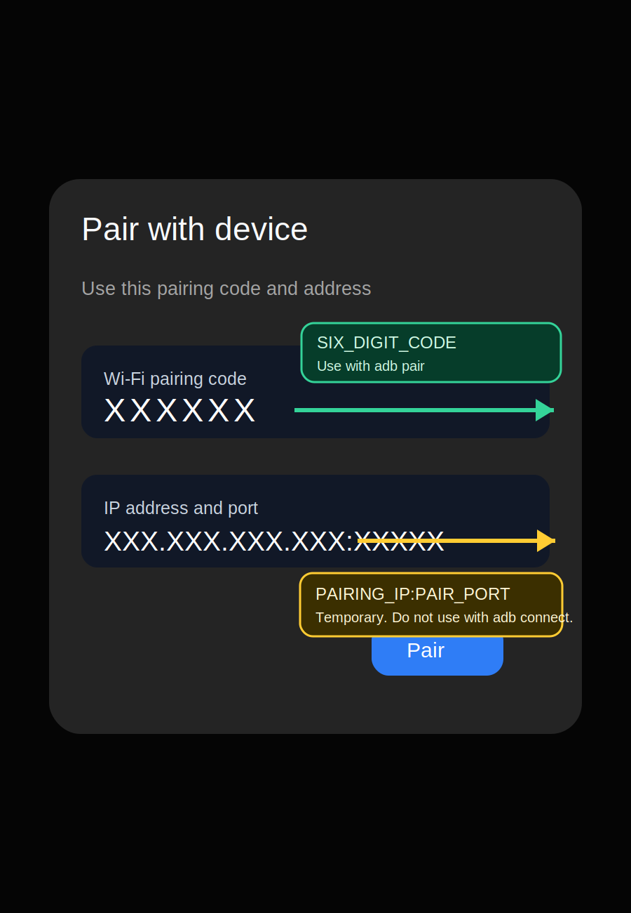
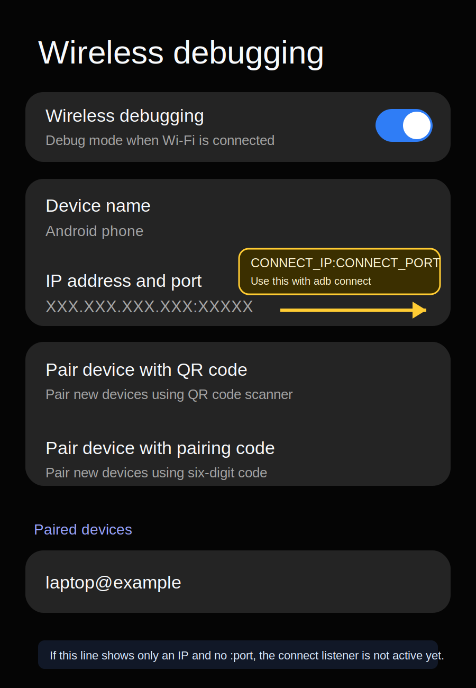

# ADB Without USB or a Common Wi-Fi Router

Use Android ADB when you do not have USB data and both devices are not on the same Wi-Fi router.

This works for normal ADB workflows: `adb install`, `adb shell`, `adb logcat`, Android Studio, scrcpy, and other tools that use ADB.

## Before You Start

You need:

- Windows 10/11 laptop with Wi-Fi.
- Android 11+ phone.
- Developer options enabled on the phone.
- Wireless debugging enabled on the phone.
- This repo downloaded and extracted on the laptop.

You do not need:

- USB data cable.
- Home Wi-Fi router.
- Public Wi-Fi.
- A second phone.

## Process: Start to Finish

Follow these steps in order. Do not jump around unless a step tells you to. If you only want the process, read this section and ignore the guide until something fails.

1. Download this repo as a ZIP from GitHub, then extract it.

2. Open the extracted folder.

3. To start setup, double-click:

   ```text
   START_HERE.cmd
   ```

4. If your goal is APK install, drag the APK file onto `START_HERE.cmd` instead of double-clicking it. Then continue with the next step.

5. A PowerShell wizard will open. If it asks to download Android platform-tools, press Enter for yes.

6. The wizard will start a laptop-created Wi-Fi network. A second PowerShell window may open. Keep it open.

7. The wizard will show a Wi-Fi name and password. On the phone, connect Wi-Fi to that network.

8. If the phone says the Wi-Fi has no internet, choose **Stay connected** or **Use this network anyway**.

9. In the wizard, press Enter after the phone is connected to the laptop-created Wi-Fi.

10. If the wizard asks to enable Windows Internet Connection Sharing, press Enter for yes on the first try. Approve the Windows admin prompt if it appears.

11. On the phone, open:

    ```text
    Developer options -> Wireless debugging
    ```

12. Tap:

    ```text
    Pair device with pairing code
    ```

13. Keep the pairing popup open.

14. If the wizard asks for `PAIRING_IP:PAIR_PORT`, copy the IP address and port from the same pairing popup.

15. In the wizard, enter the six-digit pairing code shown on the phone.

16. After pairing succeeds, close the pairing popup on the phone.

17. Stay on the main **Wireless debugging** screen.

18. If the wizard asks for `CONNECT_IP:CONNECT_PORT`, use the **IP address and port** line from the main Wireless debugging screen. Do not reuse the pairing popup port.

19. When the wizard asks whether to switch to stable TCP ADB mode, press Enter for yes.

20. If you dragged an APK onto `START_HERE.cmd`, the wizard will try to install it.

21. The wizard will print the ADB device list. Success means the phone appears as `device`, like this:

    ```text
    XXX.XXX.X.X:XXXXX    device
    ```

After that, this is normal ADB. Any app or tool that uses ADB can use the device.

## Phone Screen Cheat Sheet

Use this only when the wizard asks for a code, IP address, or port.

### Pairing Popup



This screen appears after tapping **Pair device with pairing code**.

- The six-digit number looks like `XXXXXX`.
- The pairing address looks like `XXX.XXX.XXX.XXX:XXXXX`.
- Use this address only when the wizard asks for `PAIRING_IP:PAIR_PORT`.

### Main Wireless Debugging Screen



This is the normal Wireless debugging screen after pairing.

- The connect address looks like `XXX.XXX.XXX.XXX:XXXXX`.
- Use this address only when the wizard asks for `CONNECT_IP:CONNECT_PORT`.
- Do not reuse the pairing popup port here.

Quick rule:

```text
Pairing popup = pairing code and pairing port.
Main Wireless debugging screen = connect port.
```

## After It Works

Install an APK:

```powershell
.\work\android\platform-tools\adb.exe install -r "C:\path\to\app.apk"
```

Open shell:

```powershell
.\work\android\platform-tools\adb.exe shell
```

Read logs:

```powershell
.\work\android\platform-tools\adb.exe logcat
```

Reconnect later if stable TCP ADB mode is still active:

```powershell
.\work\android\platform-tools\adb.exe connect <PHONE_IP_OR_GATEWAY>:<STABLE_TCP_PORT>
```

## If It Fails

Run the wizard again from the beginning:

```text
START_HERE.cmd
```

If it still fails:

1. On the phone, go to Wireless debugging -> Paired devices.
2. Forget the old laptop pairing.
3. Run `START_HERE.cmd` again.
4. Read [GUIDE.md](GUIDE.md) for the detailed explanation, screenshots, manual commands, and troubleshooting.

## Important Limits

- Android will not let a laptop silently enable ADB. You must enable Wireless debugging on the phone.
- Android will not let a script silently approve pairing. You must enter the pairing code.
- This is not "ADB without Wi-Fi at all." It creates a small local Wi-Fi network from the laptop.
- This does not repair broken USB hardware. It bypasses USB data by using wireless ADB.
